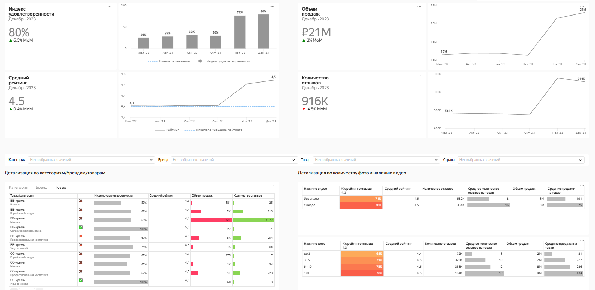

### Анализ удовлетворенности покупателей  

**Стек:** Yandex DataLens, MS Excel.  

**Задача:**  
Необходимо разработать дашборд, который позволит удобно отслеживать состояние ключевых метрик удовлетворенности в динамике, исключая необходимость ручного сбора данных.  
Он поможет отслеживать общие метрики и решать задачи, такие как:   
● Анализ удовлетворенности и эффективности ассортимента;   
● Улучшение тактик оформления карточек товаров;   
● Исследование товаров с низким рейтингом для принятия решения о последующих закупках.  
Дашборд будет часто использоваться командой по анализу маркетплейса, категорийными менеджерами, аналитиками для оценки вовлеченности и удовлетворенности покупателей на ежемесячных встречах. Раз в месяц он будет использоваться для отчетности перед CPO.   

**Метрики:**  
1. Индекс удовлетворенности продуктом -процент продуктов с рейтингом более 4.3. Показатель можно агрегировать до бренда/категории.   
2. Средний рейтинг.   
3. Количество отзывов.   
4. Объем продаж.   
5. Анализ качества визуала карточек
 
**Вопросы и бизнес-решения:**  
**На сколько клиенты удовлетворены продуктом**   
Индекс удовлетворенности должен быть не менее 80% и средний рейтинг более 4.3. Для этого анализируются карточки товаров, внимательно изучаются отзывы, чтобы выявить причины низкого рейтинга. Постоянно проводится анализ ассортимента, исключаются товары с низким рейтингом и вовлеченностью, вводятся новинки, следуя трендам и предпочтениям клиентов.  
**Какова вовлеченность клиентов в улучшении продукта**    
Разрабатываются программы поощрения для стимулирования обратной связи от пользователей.   
**Какой объем продаж за последние 8 недель. Какая динамика.**  
Если показатели существенно отклоняются от плановых значений, это становится поводом для более глубокого анализа.  
**Качество визуала карточек товара.**  
Для оценки визуала карточек используется информация о количестве фотографий и наличии видео в карточках товаров.

Данные находятся в файле **[Данные для дашборда](https://github.com/NailyaGalina/DataLens_Dashboard_customer/blob/main/%D0%94%D0%B0%D0%BD%D0%BD%D1%8B%D0%B5%20%D0%B4%D0%BB%D1%8F%20%D0%B4%D0%B0%D1%88%D0%B1%D0%BE%D1%80%D0%B4%D0%B0.xlsx)**  
Разработанный дашборд доступен по ссылке https://datalens.yandex/c1li1catlotex  

**Особенности данных:**  
Данные хранятся в таблице с основными метриками: SKU (ID товара), категория, предмет, бренд, продажи, отзывы, рейтинг, количество фото в карточке, наличие видео в карточке, страна производителя.  
Для основных показателей есть 2 столбца с наблюдениями за 2 последних месяца — декабрь и ноябрь.  
Есть отдельная выгрузка с показателями брендов за последние полгода, которую мы собирали в полуавтоматическом режиме.   

**Справочник полей:**  

**Лист Products**  

● SKU — уникальный id товара.  
● Категория — категория товара.   
● Предмет — наименование предмета (как подкатегория/тип).  
● Бренд — бренд-производитель товара.  
● Продажи (Декабрь) — объем продаж в декабре 2023 (с учетом отказов, в единицах товара).  
● Продажи (Ноябрь) — объем продаж в ноябре 2023 (с учетом отказов, в единицах товара).  
● Страна — страна происхождения товара.  
● Дата появления карточки — Дата появления карточки на маркетплейсе.  
● Кол-во фото — Кол-во фотографий в карточке товара.  
● Видео — Наличие видео в карточке товара (1 - есть/0 - нет).  
● Рейтинг (Декабрь) — Средний рейтинг товара в декабре 2023.  
● Рейтинг (Ноябрь) — Средний рейтинг товара в ноябре 2023.  
● Отзывы (Декабрь) — Число отзывов за товар в декабре 2023.  
● Отзывы (Ноябрь) — Число отзывов за товар в ноябре 2023  

**Лист Dynamic**  

● Бренд — бренд-производитель товара.  
● Месяц — дата начала месяца отчетности.  
● Продажи — объем продаж за месяц (с учетом отказов, в единицах товара).  
● Рейтинг — средний рейтинг бренда за месяц.  
● Отзывы — количество отзывов по бренду за месяц.  
